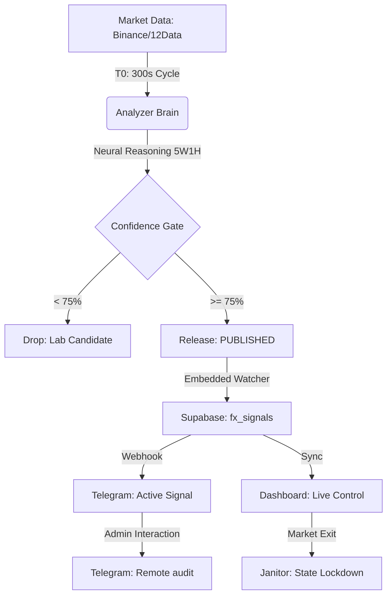

# 🌌 Quantix AI Core - Master Architecture v4.0 PRO
*The Single Source of Truth for Institutional Intelligence & Execution*

---

## 🏗️ 1. Architecture Philosophy
Quantix is designed as a **Distributed Market Intelligence Engine** operating on the **5W1H Transparency Framework** (Who, What, Where, When, Why, How). 

### Core Pillars:
1.  **Distributed Intelligence**: Micro-services running independently on Railway Cloud.
2.  **Institutional Validation**: Cross-verification of data via Binance & TwelveData feeds.
3.  **Unified Observability**: Global audit system with remote Telegram control.
4.  **Embedded Atomicity**: Integrated Watcher tasks within the Analyzer to prevent race conditions.

---

## 🛰️ 2. Distributed Service Map (Railway Ecosystem)

| Service | Script | Role | Observability Key |
| :--- | :--- | :--- | :--- |
| **API Server** | `start_railway_web.py` | Signal broadcast & Client sync | `UVICORN_LOG` |
| **Analyzer** | `start_railway_analyzer.py` | Brain + **Embedded Watcher** (v3.8) | `ANALYZER_LOG` |
| **Watcher** | `start_railway_watcher.py` | Standalone Monitor (Legacy Redundancy) | `WATCHER_LOG` |
| **Validator** | `start_railway_validator.py` | Discrepancy & Feed audit (Binance) | `VALIDATOR_LOG` |
| **Watchdog** | `start_railway_watchdog.py` | Active Healing (Janitor) & System Safety | `WATCHDOG_LOG` |

---

## 📊 3. End-to-End Signal Pipeline

---

## 🧠 4. Strategy & Trading Rules (Institutional v4.0 PRO)

### Signal Release Logic:
*   **Confidence Threshold**: **75% (0.75)** (Raised for v4.0).
*   **Asset**: EURUSD (M15 Primary).
*   **Refinement**: Neural weighted scoring (Structure + Session + Volatility).

### Dynamic TP/SL Logic (v4.0.3 - Standard Edition):
*   **Take Profit (TP)**: **Fixed 7.0 pips** (Stable execution).
*   **Stop Loss (SL)**: Dynamic 1.0x ATR | **Min 10.0 pips** / Max 15.0 pips.
*   **R:R Baseline**: ~ 1 : 0.7 (Mạo hiểm 10 pips ăn 7 pips).

### Dynamic Risk Management:
*   **Risk-Free Protocol**: Move SL to Entry (Breakeven) when price reaches **70%** toward TP.
*   **Max Pending**: 35 minutes (Entry window).
*   **Max Duration**: **150 minutes** (Redefined from 180m for institutional scalping).
*   **Entry Strategy**: Market Execution prioritized for confidence > 80% or FVG Proximity.

---

## 🔬 5. Global Observability & Control
### Remote Admin Commands (Telegram):
Admin can control the production engine directly from mobile:
*   `/audit`: Triggers a comprehensive global health check (Online + DB integrity).
*   `/unblock`: Manually triggers the Janitor to release stuck signals/pipelines.
*   `/status`: Checks real-time pulse of all worker instances.
*   `/free`: Release signal blockages (Janitor force run).

### Institutional Transparency (v4.0):
*   **Dynamic R:R Disclosure**: Telegram broadcasts now compute and display real-time Risk-to-Reward ratios per signal (e.g., `R:R: 1 : 1.52`).
*   **5W1H Explainability**: Every signal includes a "Why" metadata tag explaining the structural and volatility basis.
*   `audit.bat`: Local/PC command for deep diagnostic reports.
*   `backend/audit_online.py`: External verify via Public API Gateway.

---

## 📁 6. Repository Ecosystem
The project is split into two specialized repositories:
1.  **`Quantix_AI_Core`**: The "Backend/Brain" containing analysis logic, database wrappers, and service launchers.
2.  **`Telesignal` / `quantix-live-execution`**: The "Frontend/Terminal" focused on real-time signal display and execution visualization.

---
**Version**: 4.0 PRO | **Build**: 2026-03-06-UTC  
*Document verified 2026-03-06 by Antigravity AI.*

