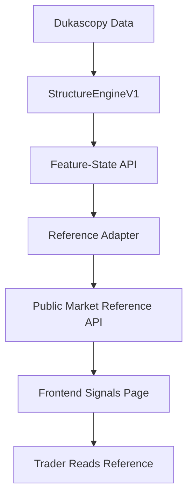

# 🧠 QUANTIX AI – SIGNAL / REFERENCE WORKFLOW (OFFICIAL)

**Status:** ✅ IMPLEMENTED  
**Commit:** `525298f` (Merged to main)

---

## PHẦN 1️⃣ – OFFICIAL JSON SCHEMA (PUBLIC-READY)

### 📦 MarketStructureReference.schema.json
```json
{
  "meta": {
    "symbol": "EURUSD",
    "timeframe": "M15",
    "session": "London-NewYork",
    "generated_at": "2026-01-13T11:11:00Z",
    "expires_at": "2026-01-13T22:00:00Z",
    "engine_version": "structure_engine_v1"
  },
  "bias": {
    "direction": "bullish",
    "confidence": 0.96
  },
  "price_levels": {
    "interest_zone": {
      "from": 1.16710,
      "to": 1.16750
    },
    "structure_target": 1.17080,
    "invalidation_level": 1.16480
  },
  "metrics": {
    "projected_move_pips": 35,
    "structure_rr": 1.4,
    "volatility_context": "intraday"
  },
  "validity": {
    "session_only": true,
    "auto_invalidate_on": [
      "target_reached",
      "invalidation_breached",
      "session_closed"
    ]
  },
  "disclaimer_level": "public_reference"
}
```

---

## PHẦN 2️⃣ – MAP ENGINE → API → FRONTEND (END-TO-END)

### 🔌 API SOURCE (Backend)
- **Endpoint:** `GET /api/v1/public/market-reference`
- **Schema Implementation:** `quantix_core.schemas.reference.MarketStructureReference`

### 🧠 TRANSFORM LAYER (Backend / API Adapter)
The `reference.py` router acts as the adapter, converting raw `StructureEngineV1` output into semantic intelligence.

---

## PHẦN 3️⃣ – FRONTEND RENDER WORKFLOW

### 🖥️ UI CARD FLOW
- **Asset:** EUR/USD
- **Badge:** 🟢 Bullish (or 🔴 Bearish)
- **Visuals:** Confidence meter + Interest zone ranges + Target/Invalidation levels.

---

## PHẦN 4️⃣ – DISCLAIMER WORDING (PUBLIC-SAFE)

### ✅ Global Footer Disclaimer
⚠️ Quantix provides AI-generated market structure references for educational and analytical purposes only. This is not financial advice or a trading signal.

---

## PHẦN 5️⃣ – COMPLETE WORKFLOW SUMMARY (1 GLANCE)



---

**Last Updated:** 2026-01-15 09:55 UTC  
**By:** Antigravity AI
