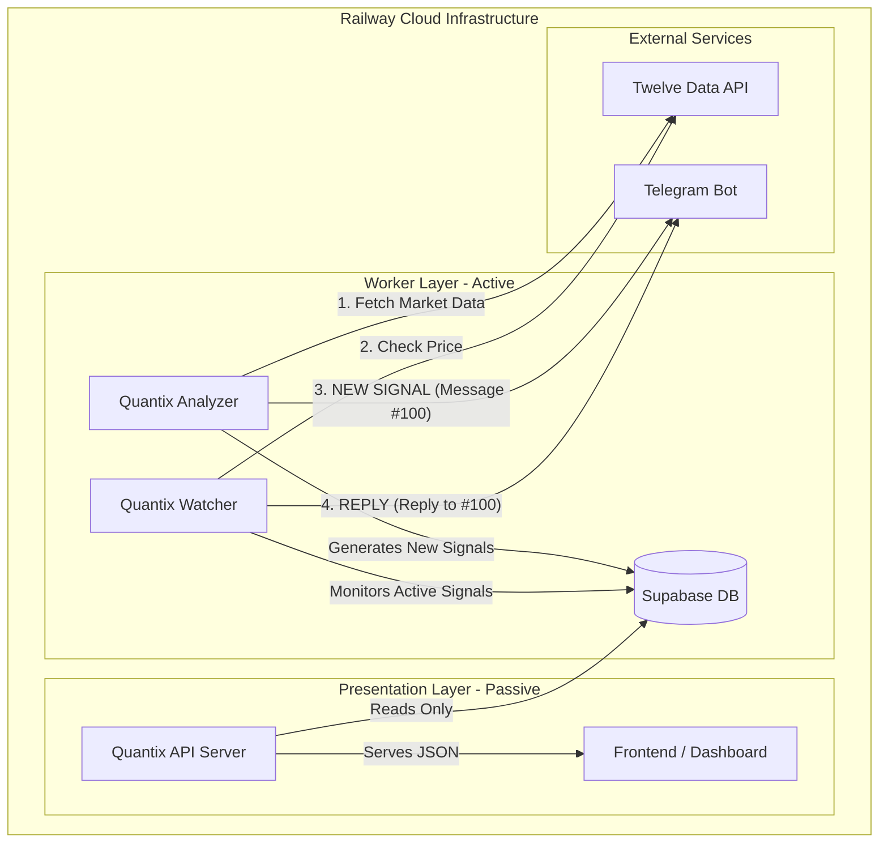

# QUANTIX AI ARCHITECTURE & TIMING DIAGRAM (v2.2)

## 🏛️ Core Architecture: "Split-Brain" Decoupled System

The system is strictly divided into three isolated layers to prevent race conditions and duplicate actions.

## ⏱️ Timing & Lifecycle Sequence

### 1. Signal Generation Cycle (Analyzer)
- **Interval:** Every 120 seconds (2 mins).
- **Quota Impact:** 720 requests/day.
- **Process:**
  1.  **Zombie Cleanup:** Check for & delete stuck signals (No TG ID, >2 mins old).
  2.  **Gate Check:** STOP if any signal is currently `WAITING` or `ENTRY_HIT`.
  3.  **Analysis:** Fetch M15 Candle -> Calculate Structure -> Check Confidence (>90%).
  4.  **Creation:** Insert `WAITING` signal into DB (Internal).
  5.  **Release:** Send to Telegram -> Get Message ID (#123) -> Update DB with ID.

### 2. Signal Monitoring Cycle (Watcher)
- **Interval:** Every 240 seconds (4 mins).
- **Process:**
  1.  **Scan:** Query DB for `WAITING` or `ENTRY_HIT` signals.
  2.  **Fetch:** Get Real-time Price from Twelve Data.
  3.  **Compare:**
      - If Price >= Entry: Update DB `ENTRY_HIT` -> **Reply** to Telegram #123.
      - If Price >= TP: Update DB `CLOSED (WIN)` -> **Reply** to Telegram #123.
      - If Price <= SL: Update DB `CLOSED (LOSS)` -> **Reply** to Telegram #123.
      - If Time > Expiry (15m): Update DB `CANCELLED` -> **Reply** to Telegram #123.
      - If Time > Max Duration (30m): Update DB `TIME_EXIT` -> **Reply** to Telegram #123.

### 🚫 Anti-Spam Guardians (The 3 Locks)

| Lock Name | Location | Function |
| :--- | :--- | :--- |
| **Global Hard Lock** | `Analyzer` | Prevents NEW signals if ANY signal is active. Ensures "One at a Time". |
| **Zombie Nuke** | `Analyzer` | Instantly deletes "Ghost Signals" (no ID) created by old workers. |
| **Atomic Guard** | `Watcher` | **Refuses** to send Telegram notification if signal has no `telegram_message_id`. |

## 📊 Data Flow & Source of Truth

1.  **Twelve Data:** The Source of Truth for **PRICE**.
2.  **Supabase DB:** The Source of Truth for **STATE** (Waitting, Active, Closed).
3.  **Telegram:** The Source of Truth for **PUBLIC PROOF** (Timestamped Messages).

---
*Updated: 2026-02-04*
