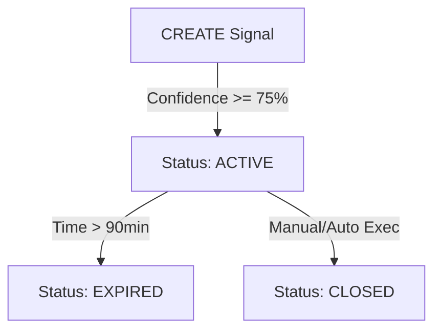

# QUANTIX SIGNAL LOGIC v1 – MARKET_NOW
## Technical Snapshot (2026-01-30)

### 🧠 1. Logic Snapshot: "Market State Recognition"
Trong phiên bản v1 này, Quantix hoạt động theo mô hình **Reactive (Phản ứng)**. Toàn bộ logic xoay quanh việc "Chụp ảnh" (Snapshot) trạng thái thị trường tại thời điểm hiện tại T và biến nó thành một lệnh giao dịch ngay lập tức (Market Order).

*   **Signal Trigger**: Được tạo ra mỗi khi `ContinuousAnalyzer` chạy (120s) và vượt qua ngưỡng Confidence (75% cho DB, 95% cho Telegram).
*   **Entry Logic**: 
    *   `Entry = Market Price` tại thời điểm phân tích (T0).
    *   Không có khái niệm "Chờ khớp" (Waiting for Entry).
*   **TP/SL Logic**: 
    *   Sử dụng quy tắc **Fixed 10 Pips (AUTO v0)**.
    *   TP/SL được tính toán dựa trên `Market Price` tại T0.
*   **Expiry Logic**:
    *   Tín hiệu có hiệu lực trong vòng **90 phút** kể từ thời điểm tạo.
    *   Sau 90 phút, trạng thái tự động chuyển thành `EXPIRED`.

---

### 🗄️ 2. Data Schema Snapshot
Mẫu dữ liệu đóng băng cho 1 Signal (JSON Example):

```json
{
  "asset": "EURUSD",
  "direction": "BUY",
  "timeframe": "M15",
  "entry_low": 1.09371,
  "entry_high": 1.09391,
  "tp": 1.09471,
  "sl": 1.09271,
  "ai_confidence": 1.0,
  "strength": 0.91,
  "reward_risk_ratio": 1.0,
  "status": "ACTIVE",
  "generated_at": "2026-01-30T07:56:00Z"
}
```

**Các trường quan trọng:**
*   `status`: Chỉ gồm `ACTIVE`, `CANDIDATE`, `EXPIRED`.
*   `entry_low`: Luôn bằng giá Close của nến gần nhất.

---

### 🧩 3. State Machine Snapshot (v1)

Hệ thống hiện tại là một luồng thẳng, không có vòng lặp hoặc trạng thái trung gian chờ đợi:



**Hạn chế của v1**: Coi Market Price hiện tại là điểm vào đẹp nhất, không quan tâm đến vùng giá (Value Zone).

---

### 🖼️ 4. Evidence Snapshot (Historical Baseline)

Dựa trên dữ liệu Telegram cuối cùng trước khi thay đổi:
*   **Timestamp**: 30-Jan-26 2:56 PM
*   **Signal**: `EURUSD | M15 | BUY`
*   **Entry**: `1.19371`
*   **TP**: `1.19471` (+10 pips)
*   **SL**: `1.19271` (-10 pips)
*   **Bằng chứng**: Khoảng cách TP/SL được tính toán đối xứng tuyệt đối qua giá Entry tại thời điểm gởi tin. Logic "Market Now" hoạt động hoàn hảo theo đúng thiết kế v1.

---

**Git Tag Reference**: `quantix-core@pre-entry-wait`
**Author**: Quantix AI Assistant (Antigravity)
**Status**: ⛔ FROZEN - DO NOT MODIFY THIS FILE
